<html><head><meta content="text/html; charset=UTF-8" http-equiv="content-type"></head><body class="c16 c125">

Software Engineering &nbsp;

Software Requirements Specification (SRS) Document 

Author(s): Tahsin Abrar 

Montasir Tasnim Al Rafi 

Nimur Rashid Imon 

Mohammad Rahatul Islam 

Md. Rafidul Islam 

Affiliation: Team HHJN 

Date: July 07, 2021 

<table class="c204"><tr class="c41"><td class="c194" colspan="1" rowspan="1">
Contents
</td></tr></table>

1. Introduction 

1.1 Purpose of this document 

1.2 Scope of this document 

1.3 Overview 

1.4 Business Context 

2. General Description 

2.1 Product Functions 

2.2 User Characteristics Stephen 

2.3 User Objectives 

2.4 General Constraints 

3. Functional Requirements 

4. Interface Requirements 

4.1 User Interfaces 

4.2 Hardware Interfaces 

4.3 Communications Interfaces 

4.4 Software Interfaces 

5. Performance Requirements 

6. Other non-functional attributes 

6.1 Security 

6.2 Reliability 

6.3 Maintainability 

6.4 Portability 

7. Operational Scenarios 

8. Preliminary Use Case Model 

8.1 Use Case Model 

9. Updated Schedule 

10. Appendices 

10.1 Definitions, Acronyms, Abbreviations

1. Introduction&nbsp;

1.1 Purpose of this document &nbsp;

The purpose of this document is to describe in detail the IIUC Bus Management System which will be useable and accessible for Students of International Islamic University Of &nbsp;Chittagong. In addition to listing and explaining, the document serves as a roadmap for the &nbsp;software, of what we are currently doing on the software, what we plan to do. Within this &nbsp;document, readers can find information about our general project concepts, a list of &nbsp;functional and non-functional requirements, examples of our graphical user interfaces (GUI), &nbsp;as well as information about our current schedule and case models. &nbsp;

1.2 Scope of this document 

This project is a prototype for the Bus Management system and it is accessible for only &nbsp;the students, guest of International Islamic University Chittagong . This has been &nbsp;implemented under the guidance of University professor. This project is useful for the Bus &nbsp;Management authority and as well as to all the passengers.&nbsp;

1.3 Overview 

&nbsp;The Purpose of the IIUC Bus management system is to ease bus management and to &nbsp;create a convenient and easy-to-use application for the students and guest . The system is &nbsp;based on a relational database with its bus management and reservation functions. Above all, &nbsp;we hope to provide a comfortable user experience along for the target audience. This will &nbsp;allow anyone at International Islamic University, the ability to find information not only about the regular bus schedule, but also the special day ones. In addition to that, it will &nbsp;provide map of different route. &nbsp;

1.4 Business Context&nbsp;

Islamic University Chittagong (IUC) was founded in 1995 by Islamic University &nbsp;Chittagong Trust (IUCT), a non-profit organization. In 2000, IUC was upgraded to &nbsp;International Islamic University Chittagong (IIUC).[4]&nbsp;

International Islamic University Chittagong (IIUC) is one of the top graded Government &nbsp;approved private universities in Bangladesh. The credit for the idea of establishing this &nbsp;University goes to Islamic University Chittagong Trust (IUCT), which is the founder &nbsp;organization of the University. This Trust is a non-political and non-profit oriented voluntary &nbsp;organization, registered with the Government of the People&#39;s Republic of Bangladesh under &nbsp;the Societies Act XXI of 1860. This Trust felt the need for a university under private initiative &nbsp;in view of the absence of institutions of higher learning based on Islamic vision of life in the &nbsp;public sector. With this idea having its origin in 1990, the Trust discussed the concept of a &nbsp;private Islamic university with a group of intellectuals, Islamic thinkers, and educationists, &nbsp;from home and abroad. It was these Islamic personalities that came forward to materialize the &nbsp;dream of such an institution by putting their ideas, energies and fulfilling other requirements. &nbsp;In 1992 an anchor organization called Islamic University Chittagong Trust (IUCT) was &nbsp;founded under the aegis of this body and an institution of higher learning under the name of &nbsp;Islamic University Chittagong got the Government&#39;s approval on February 11, 1995 and the &nbsp;University was founded accordingly in the same year. Thus a long cherished dream of the &nbsp;people of Chittagong came into reality. In the year 2000 Islamic University Chittagong (IUC) &nbsp;was upgraded into International Islamic University Chittagong (IIUC), thus it got a scope to &nbsp;extend its services to the Ummah at large. 

In 2004 IIUC was recognized as one of the 9 top-graded Private Universities by a &nbsp;Government-appointed High Powered Team led by the UGC Chairman. At present, it is the &nbsp;largest private university with 370 (Full time: 270 &amp; Adjunct: 100) teachers and 14000 &nbsp;students from home and abroad. A good number of full-time teachers and students are &nbsp;studying abroad for pursuing higher studies with IIUC&#39;s scholarship or financial assistance or &nbsp;continuation of services.

The Graduation degrees of CSE, EEE &amp; CCE are accredited by the BAETE. IIUC grants &nbsp;waiver, generous financial assistances and scholarships to the students at different rates &nbsp;depending on the results of their previous examinations and financial condition. IIUC &nbsp;participated in different national and international contests, winning prizes for obtaining &nbsp;prestigious positions. IIUC successfully organized five International Conferences on different &nbsp;important issues relating to education, ethics and Islamization of knowledge. It also arranged the &nbsp;National Computer Programming Contest in collaboration with the Ministry of Science &amp; ICT &nbsp;and Bangladesh Computer Council (BCC) as part of its regular programs. 

The campus is in Kumira, Chittagong (facing Dhaka-Chittagong Highway).&nbsp;

Hostel accommodation is available. The hostels are as follows (separate hostel for foreign &nbsp;students): 

Permanent Campus (Kumira): 

1. Hazrat Abu Bakr (R.A) Hall 

2. Hazrat Umar (R.A) Hall 

3. Hazrat Uthman (R.A) Hall 

4. Hazrat Ali (R.A) Hall (Under Construction) 

Chittagong City: 

1.Prasanti Vaban (Kornel hat)

2. General Description&nbsp;

2.1 Product Functions &nbsp;

The proposed system will be able to maintain Bus Schedule for users. Admins will be &nbsp;able to log on to update information and documents available for the general public. Among &nbsp;certain features there will be a database, route map, a real time calendar, an GUI, and other &nbsp;features. Any user using the software shall be able to use every feature mentioned providing &nbsp;their computer has the proper software and/or hardware. 

2.2 User Characteristics &nbsp;

The user of this software will be students, guest who wants to visit IIUC. They can know &nbsp;weekly bus schedule and also special day bus schedule. Also admins can use the software to &nbsp;ease up and maintain bus system in a effective way. The user interface is made in a friendly &nbsp;way so that user can find what they are looking for easily. &nbsp;

2.3 User Objectives &nbsp;

Users of the system should be able to retrieve Bus Schedule information between two &nbsp;location with the given date/time of travel from the database.&nbsp;The system will support three&nbsp;types of user privileges, Student, Guest and Admin. Student and Guest will have access to &nbsp;Bus Schedule information and some other limited features but the admins will have full &nbsp;control of bus management.&nbsp;

2.4 General Constraints &nbsp;

&#9679; The project must be completed within the time-constraints of the semester. &nbsp;&#9679; The project must be completed using Programming language like: Java, Python etc.

3. Functional Requirements&nbsp;

1. System shall allow Sign-in for Student 

1. Description 

There will a home interface. From there when user clicks on Sign-in button then that &nbsp;will take user to another page and prompt for an username and password. After login &nbsp;the user shall be taken back to the Schedule page where there will be profile info, &nbsp;schedule, request bus, edit options. 

2. Technical issues 

&#9679; System allows to add Username. 

&#9679; System allows to add Password. &nbsp;

3. Risks 

A possible threat exists if the system does not recognize a proper login. To prevent &nbsp;this risk user must always remember their username and password. If they forget &nbsp;those then they have to contact with the IT department. To prevent this risk extensive &nbsp;testing shall be done to insure there are no problems. 

1.1 System shall allow Student to See Profile Info 

1. Description 

&nbsp;After sign-in student can see immediately their own Profile which will contain the &nbsp;data which they have given during sign-up. &nbsp;

2. Technical issues 

&#9679; System Displays Username. 

&#9679; System Displays Gender. &nbsp;

&#9679; System Displays ID. 

&#9679; System Displays Location. 

3. Risks 

A possible threat exists if the system does not recognize a proper login. To prevent this &nbsp;risk user must always remember their username and password. If they forget those then &nbsp;they have to contact with the IT department. To prevent this risk extensive testing shall &nbsp;be done to insure there are no problems. 

1.2 System shall allow Student to See Schedule 

1. Description 

&nbsp;After sign-in student can click on schedule option which will show them regular, &nbsp;Friday and special day schedule. 

2. Technical issues 

&#9679; System Displays Bus No. 

&#9679; System lets to search. 

&#9679; System Displays From the location which Bus will start and also map of that &nbsp;location. 

&#9679; System Displays To the location which Bus will stop and also map of that &nbsp;location. 

&#9679; System Displays Time of the Schedule. 

&#9679; System Displays Owner of the Bus. 

3. Risks 

A possible threat exists if the system does not recognize a proper login. To prevent this &nbsp;risk user must always remember their username and password. If they forget those then &nbsp;they have to contact with the IT department. To prevent this risk extensive testing shall be &nbsp;done to insure there are no problems. 

1.3 System shall allow Student to Request Bus 

1. Description 

&nbsp;After sign-in student can click on request bus option which will take request.

2. Technical issues 

&#9679; System Allows to Add Destination. 

&nbsp;3. Risks 

&nbsp;A possible threat exists if the system does not recognize a proper login. To prevent this risk user must always remember their username and password. If they forget those &nbsp;then they have to contact with the IT department. To prevent this risk extensive testing &nbsp;shall be done to insure there are no problems. 

1.4. System shall allow Student to Edit Profile 

1. Description 

&nbsp;After sign-in student can click on profile edit to edit their profile info. 

2. Technical issues 

&#9679; System allows to edit username. 

&#9679; System allows to edit gender . 

&#9679; System allows to update password. 

&#9679; System allows to update location. 

3. Risks 

A possible threat exists if the system does not recognize a proper login. To prevent this &nbsp;risk user must always remember their username and password. If they forget those then &nbsp;they have to contact with the IT department. To prevent this risk extensive testing shall be &nbsp;done to insure there are no problems. 

1.5 System shall allow Student log out 

1. Description 

There will a home interface After a successful login on the sign-in page the last button &nbsp;shall allow the student to log out. After log out the user shall be taken back to the home &nbsp;page. &nbsp;

2. Technical issues 

&#9679; Implementing a timeout feature after a period of inactivity. &nbsp;

&#9679; Changing the schedule page to a home page after logging out. &nbsp;

3. Risks 

A possible threat exists if the system does not recognize a proper log out and keeps the &nbsp;student logged in. To prevent this risk extensive testing shall be done to insure there are &nbsp;no problems. 

1.6 System shall allow Student to See Notification 

1. Description 

&nbsp;After sign-in student can see notification if their request of bus is accepted. 2. Technical issues 

&#9679; System Displays Bus No. 

&#9679; System Displays From the location which Bus will start. 

&#9679; System Displays Time of the Schedule. 

3. Risks 

A possible threat exists if the system does not recognize a proper login. To prevent this &nbsp;risk user must always remember their username and password. If they forget those then &nbsp;they have to contact with the IT department. To prevent this risk extensive testing shall be &nbsp;done to insure there are no problems. 

2. System shall allow Sign-up for Student 

1. Description 

There will a home interface. From there when user clicks on Sign-up button then that 

will take user to another page and will ask to input username and password. After &nbsp;login the user shall be taken back to the Schedule page where they can search their &nbsp;desired schedule. Also they can edit their own profile 

2. Technical issues 

&#9679; System allows to add Username. 

&#9679; System allows to add Gender. 

&#9679; System allows to add ID. 

&#9679; System allows to add Password. 

&#9679; System allows to add location. 

3. Risks 

A possible threat exists if correct information is not given. To prevent this risk extensive &nbsp;testing with multiple user logins should find any problems. 

3. System shall allow Guest 

1. Description 

There will a home interface. From there when user clicks on Guest button then that will &nbsp;take user to another page and will ask to input name, gender and reason why visiting &nbsp;IIUC. &nbsp;

2. Technical issues 

&#9679; System allows to add Name. 

&#9679; System allows to add Gender. 

&#9679; System allows to add Reason why visiting IIUC. 

3. Risks 

A possible threat exists if guest doesn&rsquo;t give correct details. To prevent this risk &nbsp;extensive testing shall be done to insure there are no problems. 

3.1 System shall allow Guest to see schedule 

1. Description 

&nbsp;After inputting required information the guest shall be taken back to the Schedule &nbsp;page where they can see only regular and special day schedule. 

2. Technical issues 

&#9679; System Displays Bus No. 

&#9679; System lets to search. 

&#9679; System Displays From the location which Bus will start and also map of that &nbsp;location. 

&#9679; System Displays To the location which Bus will stop and also map of that &nbsp;location. 

&#9679; System Displays Time of the Schedule. 

&#9679; System Displays Owner of the Bus. 

3. Risks 

A possible threat exists if guest doesn&rsquo;t give correct details. To prevent this risk extensive &nbsp;testing shall be done to insure there are no problems. 

4. System shall allow the administrator 

1. Description 

There will a home interface. From there when user clicks on Admin button then that will &nbsp;take user to another page and will ask to input admin username and admin password. &nbsp;After login the user shall be taken back to the Admin page from where they can maintain &nbsp;the bus system. 

&nbsp;2. Technical issues 

&#9679; System allows to add Admin Username. 

&#9679; System allows to add Admin Password.

3. Risks 

A possible risk to the system if system doesn&rsquo;t recognize the Admin. Admin should &nbsp;always remember their username and password and input them correctly. &nbsp;

4.1 System shall allow administrator to Add Bus and Location 

1. Description 

After a successful login an administrator shall be able to Add bus and location so that &nbsp;adequate transportation is available for students and guest. 

2. Technical issues 

&#9679; System allows to add Bus no. 

&#9679; System allows to Search for Bus. 

&#9679; System allows to add Driver name. 

&#9679; System allows to add Driver number. 

&#9679; System allows to add License number. 

&#9679; System allows to add Owner name. 

&#9679; System allows to add Location. 

1. Risks 

Correct information of bus no, driver name, driver number, license number, owner &nbsp;name should be given. &nbsp;

4.2 System shall allow the administrator to Edit Bus Status 

1. Description 

After a successful login an administrator shall be able to edit bus status. 

2. Technical issues 

&#9679; System allows to Search for Bus. 

&#9679; System allow to Update and Delete Bus no. 

&#9679; System allows to Update and Delete Driver name. 

&#9679; System allows to Update and Delete Driver number. 

&#9679; System allows to Update and Delete License number. 

&#9679; System allows to Update and Delete Owner name. 

&#9679; System allows to Update Bus status. 

3. Risks 

A possible risk is if Bus status is deleted mistakenly. To prevent this risk admin should be &nbsp;careful. 

4.3 System shall allow administrator to Add Schedule. 

1. Description 

After a successful login an administrator shall be able to add schedule. By add schedule &nbsp;option admin can ease up and make new schedule depending on needs of Students and &nbsp;Guest. &nbsp;

2. Technical issues 

&#9679; System allows to Add Bus no. 

&#9679; System allows to Add the location from which Bus will start. 

&#9679; System allows to Add time of the scheduled Bus. 

&#9679; System allows to Add name of the Owner. 

&#9679; System allows to Add Mobile. 

3. Risks 

Correct information of bus no, from location, to location, time, owner, mobile should be &nbsp;given. 

4.4 System shall allow the administrator to Edit Schedule Status

1. Description 

After a successful login the administrator shall be able to edit the schedule depending on &nbsp;the needs of students and guest so that a well transportation system is available for them. 2. Technical issues 

&#9679; System allows to Update or Delete Bus no. 

&#9679; System allows to Update or Delete the location from which Bus will start. &#9679; System allows to Update or Delete the location to which Bus will stop. &#9679; System allows to Update or Delete time of the scheduled Bus. 

&#9679; System allows to Update or Delete name of the Owner. 

&#9679; System allows to Update or Delete Mobile. 

3. Risks 

A possible risk is if Schedule status is deleted mistakenly. To prevent this risk admin &nbsp;should be careful. 

4.5 System shall allow the administrator to Manage Special day and Friday Schedule 1. Description 

After a successful login the administrator shall be able to manage the special day and &nbsp;Friday schedule depending on the needs of students and guest so that a well &nbsp;transportation system is available for them. 

2. Technical issues 

&#9679; System allows to Add or Delete Bus no. 

&#9679; System allows to Add or Delete the location from which Bus will start. &#9679; System allows to Add or Delete the location to which Bus will stop. 

&#9679; System allows to Add or Delete time of the scheduled Bus. 

&#9679; System allows to Add or Delete name of the Owner. 

&#9679; System allows to Add or Delete Mobile. 

&#9679; System allows to Add or Delete date. 

3. Risks 

A possible risk is if Special status is deleted mistakenly. To prevent this risk admin &nbsp;should be careful. 

4.6 System shall allow the administrator to Review request from student 1. Description 

After a successful login the administrator shall be able to review request from student. 2. Technical issues 

&#9679; System allows to approve or cancel request. 

3. Risks 

All request should be reviewed so that transportation is available for student of all &nbsp;locality. &nbsp;

4.7 System shall allow the administrator to manage User Info 

1. Description 

After a successful login the administrator shall be able to view and delete user details. 2. Technical issues 

&#9679; System allows to display Student and Guest list with all details. 

&#9679; System allows to delete any Student or Guest from database. 

&#9679; System allows to Print from the list. 

3. Risks 

User info should be maintained regularly. 

4. Interface Requirements&nbsp;

4.1 User Interfaces 

Describes how this product interfaces with the user. &nbsp;

&#9679; 4.1.1 Starting Interface 

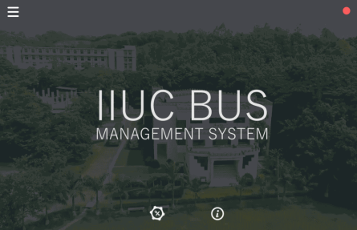

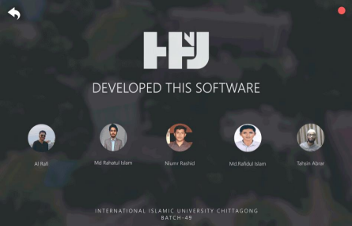&nbsp;

&#9679; 4.1.2 Home Interface 

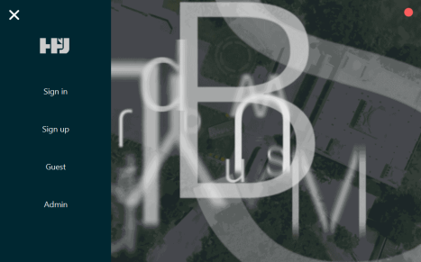&#9679; 4.1.3 Sign-in Interface

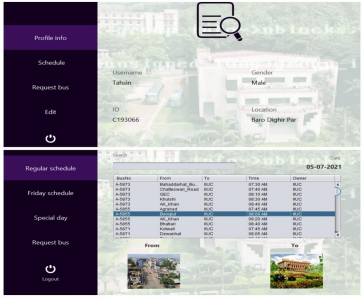

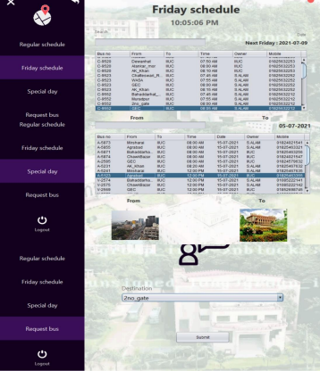12 

The IT Crowd

&#9679; 4.1.4 Sign-up Interface

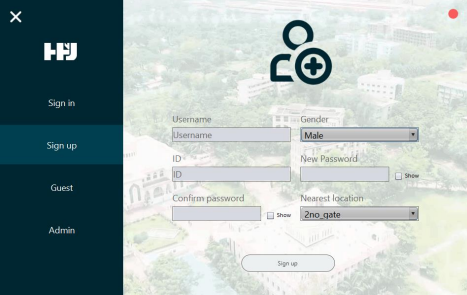

&#9679; 4.1.4 Guest Interface

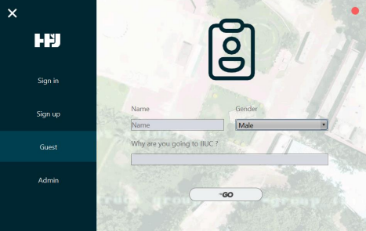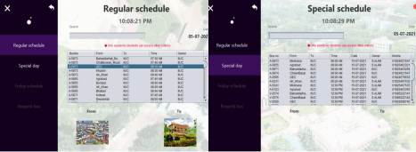

&#9679; 4.1.4 Admin Interface

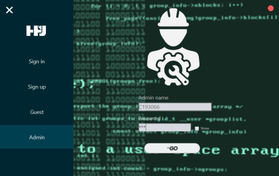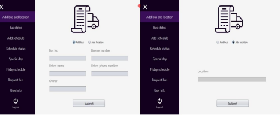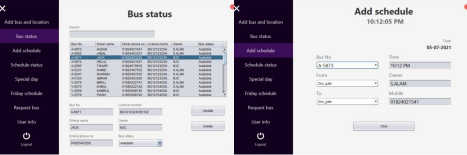

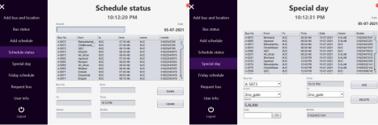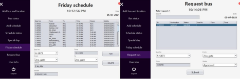

4.2 Hardware Interfaces 

The users need to have access to a keyboard, monitor, and a computer to view and manage our &nbsp;Software. Users are highly recommended to have a mouse, and speakers for full functionality. 4.3 Communications Interfaces 

The users need to have access to unrestricted Internet via broadband, dial-up or wired. &nbsp;4.4 Software Interfaces 

The users need to have java software to manage. All the software in the system should be upto &nbsp;date. Also a functional operating system that includes an up to date Internet browser with &nbsp;JavaScript enabled, such as Internet Explorer, Google Chrome, Firefox, Opera or Safari. In &nbsp;addition to a functional operating system, and Internet browser, users need an up-to-date version &nbsp;of Adobe Flash Player. 

5. Performance Requirements&nbsp;

Users should have a moderate computer with at least a 56k modem for Internet access. &nbsp;

6. Other non-functional attributes&nbsp;

6.1 Security 

The secure system shall be able to verify the administrator and other&rsquo;s username and password. &nbsp;In order to maintain correct information and features on the site, only the administrator has full &nbsp;functionality to add, edit and manage the system, all information, general schedule, calendar etc. &nbsp;In addition to the system verifying the administrator&rsquo;s username and password, it should &nbsp;recognize all the user&rsquo;s username and password. The distinction between these two users needs &nbsp;to be implemented, so that the student or guest can view the schedule and find what they are &nbsp;looking for but not add, edit or delete any information without the admins permission. &nbsp;6.2 Reliability 

The system should be accessible 24 hours a day, 7 days a week as long as the IIUC bus &nbsp;management server is up and running correctly. The users of the system shall be able to use consistently and from any computer they want to. &nbsp;

6.3 Maintainability 

The system should be easily maintainable for the average administrator. These individuals &nbsp;should be able to add, edit, or delete any information or features they feel necessary, with very &nbsp;little knowledge about Java&rsquo;s system. In order to do so, the system should be well documented &nbsp;and provide simple navigation, so future individuals can keep the software up-to-date. &nbsp;6.4 Portability 

The system should allow users to access from anywhere, from any computer.

7. Operational Scenarios&nbsp;

1. Administrator login 

The user is presented with a login form requesting username and password. They enter &nbsp;their username and password. The system then logs them in and shows them the &nbsp;administrator interface. 

2. Student Sign-in 

The user is presented with a login form requesting username and password. They enter &nbsp;their username and password. The system then logs them in and shows them the student Sign-in interface. 

3. Student can see profile, bus schedule and also edit profile 

When student signs-in then their Profile will be shown immediately. They can see the &nbsp;different bus schedule if they click schedule button. They can also request for a bus. &nbsp;Student can also edit their profile if they click profile Edit option. 

&nbsp;4. Student can request for bus 

&nbsp;After student sign-in in their account they can request for bus. A notification icon will be &nbsp; available after requesting which will show whether request is approved or not. &nbsp;5. Student Sign-up 

The user is presented with a sign-up form requesting to give username, id, gender, &nbsp;password, location. The system then redirect them to sign-in interface. 

6. Guest Service 

The user is presented with a guest form requesting name, gender and reason of going to &nbsp;IIUC. After guest fill-up the form they can see the regular and special day bus schedule. 7. Administrator can add bus and location 

After logged in admins can add bus and add location which will be available for student &nbsp;and guest. 

8. Administrator manage bus status 

After logged in admins can update bus status. They can also delete bus from database. 9. Administrator can add schedule 

After logged in admins can add schedule for students and guests. 

&nbsp;10. Administrator manage schedule status 

After logged in admins can update schedule. They can also delete schedule. &nbsp;11. Administrator manage special day service 

&nbsp;After logged in admins can add special day service for students and guests. They can also &nbsp;remove special day service. 

&nbsp;12. Administrator manage Friday schedule 

&nbsp;After logged in admins can manage Friday schedule in which they can add or remove bus &nbsp;Service. 

&nbsp;13. Administrator can review request 

&nbsp;After logged in admins can review Bus request from students. They have the power to &nbsp;both approve or cancel request. 

&nbsp;14. Administrator can manage all the User info 

After logged in admins can view all the students and guests who are using this software. They can delete any user they want. They can also print user info. 

&nbsp;

8. Preliminary Use Case Model&nbsp;

8.1 Use Case Model 

Link of the model in Pdf format: &nbsp;<a class="c186" href="https://www.google.com/url?q=https://drive.google.com/file/d/1osh_3PZAxNu7A1thrtwQSalh4X7PMUMY/view?usp%3Dsharing&amp;sa=D&amp;source=editors&amp;ust=1655320039650937&amp;usg=AOvVaw1N5NGE6pJDGTt7nXES3MWR">https://drive.google.com/file/d/1osh_3PZAxNu7A1thrtwQSalh4X7PMUMY/view?usp=sharing</a>

9. Updated Schedule&nbsp;

Date Time Project Percentage&nbsp;April 12,2021 8.25PM 0% April 20,2021 4.34PM 3% April 21,2021 11.00PM 4% April 28,2021 3.00PM 8% May 5,2021 10.00PM 15% May 21,2021 8.00PM 20% May 26,2021 9.00PM 24% June 3,2021 8.00PM 30% June 20,2021 7.00PM 35% June 22,2021 11.00PM 50% June 24,2021 8.00PM 60% June 25,2021 9.00PM 65% June 27,2021 12.20AM 70% June 28,2021 9.00PM 75% June 29.2021 7.00PM 80% June 30,2021 11.30PM 82% July 1,2021 7.00PM 85% July 2,2021 11.30PM 88% July 3,2021 8.00PM 90% July 4,2021 9.00PM 93% July 5,2021 12.10AM 95% July 6,2021 7.00PM 100%

10. Appendices&nbsp;

11. Definitions, Acronyms, Abbreviations 

Provides definitions of unfamiliar definitions, terms, and acronyms. &nbsp;

&#9679; Java: Java is an object-oriented programming language that produces software for &nbsp;multiple platforms&nbsp;

&#9679; Software: The programs and other operating information used by a computer.&nbsp;&#9679; GUI: Graphical User Interface 

&#9679; IIUC: International Islamic University Chittagong 

&#9679; XAMPP: The Full Form Of XAMPP is Cross-Platform (X), Apache (A), MariaDB (M), &nbsp;PHP (P) and Perl (P).&nbsp;

&#9679; Database: A structured set of data held in a computer, especially one that is accessible in &nbsp;various ways.&nbsp;

&#9679; PHP: Hypertext Pre-processor 

&#9679; CLI: Command Line Interface 

&#9679; API: Application Programming Interface 

&#9679; RAM: Random Access Memory 

&#9679; ROM: Read-Only Memory 

&#9679; HTML: Hypertext Markup Language 

&#9679; CSS: Cascading Style Sheets 

WYSIWYG program: What you see is what you get

The IT Crowd 

</body></html>